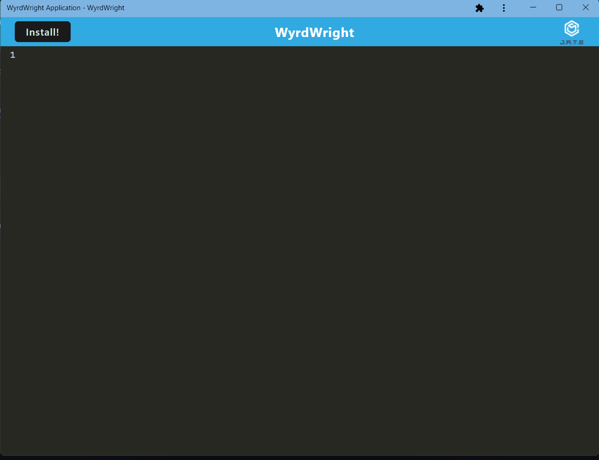

#WyrdWright
 
## Description 
  
 WyrdWright is a text editor. It can be used downloaded to be used off line. It was made using WebPack Applications, javascript, css, and html.  
  
## Table of Contents 
  
[Description](#description)
[Installation](#installation)
[Usage](#usage)
[License](#license)
[Contribute](#contribute)
[Tests](#tests)
[Questions](#questions)
   
## Installation
  
  Using github, clone down the repository. Use npm i to downloaded the needed dependancies and npm start in the root folder to build and start
  
## Usage
  
 This is a text editor that can be downloaded for use off line.
  
## License
  
None
  
## Contribute
  
Nothing may be contributed
  
## Tests
  
No tests.
  
## Questions
  
GitHub: [Elenalaree](https://github.com/elenalaree)

[WyrdWrite Website](https://wyrdwright.herokuapp.com/)

